# Deploy Amazon ElastiCache for Redis using AWS CDK

***Need for Speed*** - No, it's not the video game, but rather a critical requirement for the success of your website in this competitive world. 

Although we might think that subsecond delay is acceptable, the New York Times noted in [For Impatient Web Users, an Eye Blink Is Just Too Long to Wait](http://www.nytimes.com/2012/03/01/technology/impatient-web-users-flee-slow-loading-sites.html?pagewanted=all&_r=0) that humans can notice a 250-millisecond (a quarter of a second) difference between competing sites. In fact, users tend to opt out of slower websites in favor of faster ones. In the study done at Amazon, [How Webpage Load Time Is Related to Visitor Loss](http://pearanalytics.com/blog/2009/how-webpage-load-time-related-to-visitor-loss/), it’s revealed that for every 100-millisecond (one-tenth of a second) increase in load time, sales decrease 1%.

If someone wants data, you can deliver that data much faster if it's cached. That's true whether it's for a webpage or a report that drives business decisions. Can your business afford to not cache your webpages so as to deliver them with the shortest latency possible?

Of course, content delivery networks like [Amazon CloudFront](https://aws.amazon.com/cloudfront/) can cache part of your website's content, for example static objects like images, CSS files, and HTML files. However, dynamic data (for example, the product catalog of an ecommerce website) typically resides in a database. So we have to look at caching for databases as well. 

[Amazon ElastiCache](https://aws.amazon.com/elasticache/) is a fully managed, in-memory caching service supporting flexible, real-time use cases. You can use ElastiCache to accelerate application and database performance, or as a primary data store for use cases that don't require durability like session stores, gaming leaderboards, streaming, and analytics. ElastiCache is compatible with Redis and Memcached.

In this post, we show you how to deploy [Amazon ElastiCache for Redis](https://aws.amazon.com/elasticache/redis/) using [AWS Cloud Development Kit](https://aws.amazon.com/cdk/) (AWS CDK). The AWS CDK is an open-source software development framework to define your cloud application resources using familiar programming languages like Python.

 

## Solution Overview

We host our web application using [Amazon Elastic Compute Cloud](https://aws.amazon.com/ec2/) (Amazon EC2). We load a large dataset into a MySQL database hosted on [Amazon Relational Database Service](https://aws.amazon.com/rds/) (Amazon RDS). To cache queries, we use ElastiCache for Redis. The following architecture diagram shows the solution components and how they interact.

The application queries data from both the [Amazon RDS for MySQL](https://aws.amazon.com/rds/mysql/) database and ElastiCache, showing you the respective runtime. The following diagram illustrates this process.

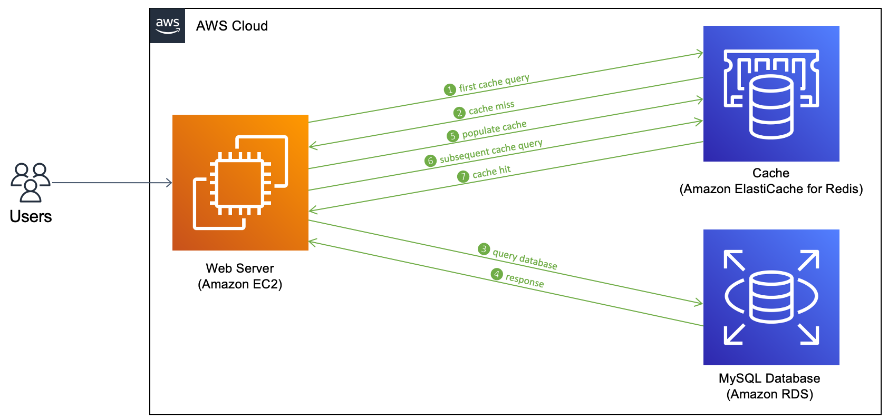


In this post, we walk you through the following steps:

1. Install the [AWS Command Line Interface](http://aws.amazon.com/cli) (AWS CLI) and [AWS CDK v2](https://docs.aws.amazon.com/cdk/v2/guide/getting_started.html) on your local machine.

2. Clone and set up the AWS CDK application.

3. Run the AWS CDK application.

4. Verify the resources created.

5. Connect to the web server EC2 instance.

6. Start the web application.

7. Use the web application.

 

So, let's begin.


## Prerequisites 

- An [AWS account](https://signin.aws.amazon.com/signin)
- [AWS CLI v2](https://docs.aws.amazon.com/cli/latest/userguide/install-cliv2.html)
- Python 3.6 or later
- node.js 14.x or later
- [AWS CDK v2](https://docs.aws.amazon.com/cdk/v2/guide/getting_started.html)

The estimated cost to complete this post is $3, assuming you leave the resources running for 8 hours. Make sure you delete the resources you create in this post to avoid ongoing charges.


## Install the AWS CLI and AWS CDK on your local machine

If you do not have AWS CLI already on your local machine, install it using this [install guide](https://docs.aws.amazon.com/cli/latest/userguide/getting-started-install.html) and configure using this [configuration guide](https://docs.aws.amazon.com/cli/latest/userguide/cli-chap-configure.html). 

Install the AWS CDK Toolkit globally using the following node package manager command:

```bash
npm install -g aws-cdk-lib@latest
```


Run the following command to verify the correct installation and print the version number of the AWS CDK.

```bash
cdk --version
```


## Clone and set up the AWS CDK application

On your local machine, clone the AWS CDK application with the following command:

```shell
git clone https://github.com/aws-samples/amazon-elasticache-demo-using-aws-cdk.git
```


Navigate into the project folder:

```shell
cd amazon-elasticache-demo-using-aws-cdk
```


Before we deploy the application, let's review the directory structure:

```shell
.
├── CODE_OF_CONDUCT.md
├── CONTRIBUTING.md
├── LICENSE
├── README.md
├── app.py
├── cdk.json
├── elasticache_demo_cdk_app
│   ├── __init__.py
│   ├── elasticache_demo_cdk_app_stack.py
│   └── user_data.sh
├── images
│   ├── ...
├── requirements-dev.txt
├── requirements.txt
├── source.bat
└── web-app
    ├── cacheLib.py
    ├── configs.json
    ├── static
    │   ├── ...
    ├── templates
    │   ├── ...
    └── webApp.py
```

The repository also contains the web application located under the subfolder web-app, which is installed on an EC2 instance at deployment. 

The cdk.json file tells the AWS CDK Toolkit how to run your application.


#### Setup a virtual environment

This project is set up like a standard Python project. Create a Python virtual environment using the following code:

```shell
python3 -m venv .venv
```


Use the following step to activate the virtual environment:

```shell
source .venv/bin/activate
```


If you’re on a Windows platform, activate the virtual environment as follows:

```shell
.venv\Scripts\activate.bat
```


After the virtual environment is activated, upgrade pip to the latest version:

```shell
python3 -m pip install --upgrade pip
```


Install the required dependencies:

```shell
pip install -r requirements.txt
```


Before you deploy any AWS CDK application, you need to bootstrap a space in your account and the Region you’re deploying into. To bootstrap in your default Region, issue the following command:

```bash
cdk bootstrap
```


If you want to deploy into a specific account and region, issue the following command:

```bash
cdk bootstrap aws://ACCOUNT-NUMBER/REGION
```

For more information about this setup, visit  [Getting started with the AWS CDK](https://docs.aws.amazon.com/cdk/latest/guide/getting_started.html)


You can now synthesize the [AWS CloudFormation](https://aws.amazon.com/cloudformation/) template for this code:

```shell
cdk synth
```


#### Other useful AWS CDK commands

 * `cdk ls`          List all stacks in the app
 * `cdk synth`       Emits the synthesized CloudFormation template
 * `cdk deploy`      Deploy this stack to your default AWS account or Region
 * `cdk diff`        Compare the deployed stack with the current state
 * `cdk docs`        Open the AWS CDK documentation


## Run the AWS CDK application

At this point, you can deploy the AWS CDK application:

```shell
cdk deploy
```


You should see a list of AWS resources that will be provisioned in the stack. Enter 'y' to proceed with the deployment.

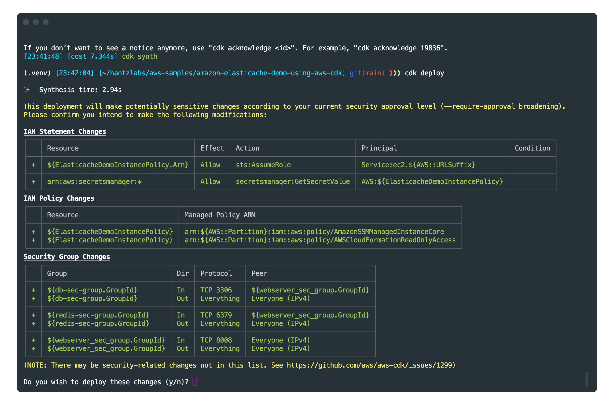


You can see the progress of the deployment on the terminal. It takes around 10 to 15 minutes to deploy the stack.

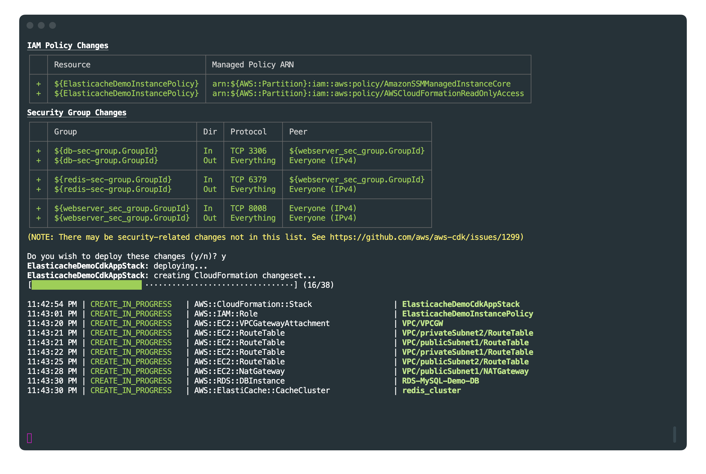


Once deployment is complete, you can see the total deployment time and AWS CloudFormation *Outputs* on the terminal. Take note of the web server public URL.


These outputs are also available on the AWS console. Navigate to the AWS CloudFormation console and choose the `ElasticacheDemoCdkAppStack` stack to see the details. 

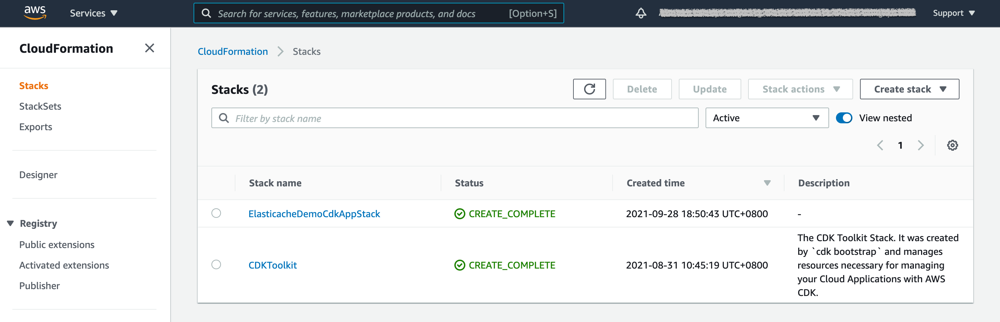


Review the resources under the **Outputs** tab. These outputs should match the outputs from the terminal when the CDK application completes.

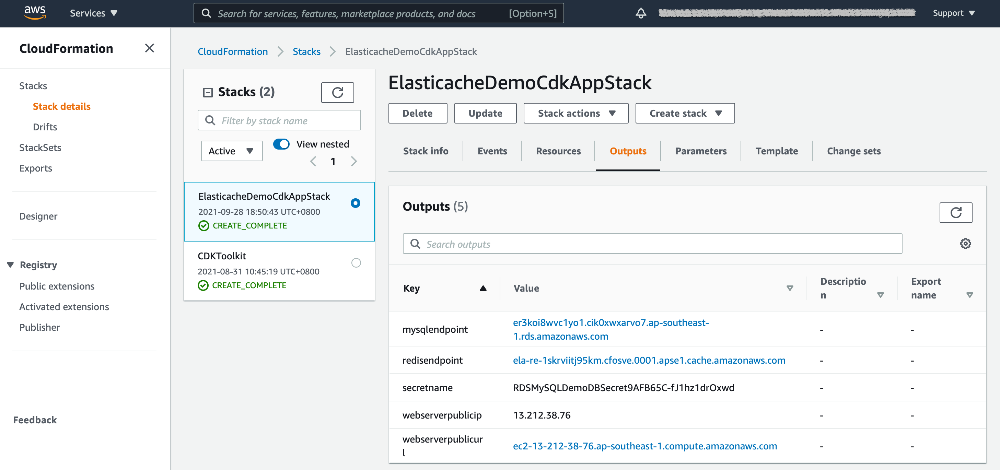


The web application retrieves these outputs automatically using the [AWS SDK for Python (Boto3)](https://aws.amazon.com/sdk-for-python/), see function `get_stack_outputs` in [cacheLib.py](https://github.com/aws-samples/amazon-elasticache-demo-using-aws-cdk/blob/main/web-app/cacheLib.py). However, take note of the web server public IP or URL. We need it to connect to the web server later.


#### AWS CDK application code

The main AWS CDK application is in the app stack file, see [elasticache_demo_cdk_app_stack.py](https://github.com/aws-samples/amazon-elasticache-demo-using-aws-cdk/blob/main/elasticache_demo_cdk_app/elasticache_demo_cdk_app_stack.py), and the whole infrastructure is defined as the `ElasticacheDemoCdkAppStack` class. Read through the comments to see what each block is doing.

First, we import the necessary libraries needed to construct the stack:

```python
from aws_cdk import (
    # Duration,
    Stack,
    aws_rds as rds,
    aws_ec2 as ec2,
    aws_iam as iam,
    aws_elasticache as elasticache,
    RemovalPolicy,
    CfnOutput
)

from constructs import Construct
```


Then in the class `ElasticacheDemoCdkAppStack`, we define the stack, starting with the virtual private network and security groups:

```python
class ElasticacheDemoCdkAppStack(Stack):

    def __init__(self, scope: Construct, construct_id: str, **kwargs) -> None:
        super().__init__(scope, construct_id, **kwargs)

        # VPC        
        vpc = ec2.Vpc(self, "VPC",
            nat_gateways=1,
            cidr="10.0.0.0/16",
            subnet_configuration=[
                ec2.SubnetConfiguration(name="public",subnet_type=ec2.SubnetType.PUBLIC,cidr_mask=24),
                ec2.SubnetConfiguration(name="private",subnet_type=ec2.SubnetType.PRIVATE_WITH_NAT,cidr_mask=24)
            ]
        )


        # Security Groups
        db_sec_group = ec2.SecurityGroup(
            self, "db-sec-group",security_group_name="db-sec-group", vpc=vpc, allow_all_outbound=True,
        )
        webserver_sec_group = ec2.SecurityGroup(
            self, "webserver_sec_group",security_group_name="webserver_sec_group", vpc=vpc, allow_all_outbound=True,
        )
        redis_sec_group = ec2.SecurityGroup(
            self, "redis-sec-group",security_group_name="redis-sec-group", vpc=vpc, allow_all_outbound=True,
        )   

        private_subnets_ids = [ps.subnet_id for ps in vpc.private_subnets]

        redis_subnet_group = elasticache.CfnSubnetGroup(
            scope=self,
            id="redis_subnet_group",
            subnet_ids=private_subnets_ids,  # todo: add list of subnet ids here
            description="subnet group for redis"
        )

        # Add ingress rules to security group
        webserver_sec_group.add_ingress_rule( 
            peer=ec2.Peer.ipv4("0.0.0.0/0"),
            description="Flask Application",
            connection=ec2.Port.tcp(app_port),
        )

        db_sec_group.add_ingress_rule( 
            peer=webserver_sec_group,
            description="Allow MySQL connection",
            connection=ec2.Port.tcp(3306),
        )

        redis_sec_group.add_ingress_rule(
            peer=webserver_sec_group,
            description="Allow Redis connection",
            connection=ec2.Port.tcp(6379),            
        )
```


Then we define the data stores used in the application, that is, Amazon RDS for MySQL and Amazon ElastiCache:

```python
        # RDS MySQL Database
        rds_instance = rds.DatabaseInstance(
            self, id='RDS-MySQL-Demo-DB',
            database_name='covid',
            engine=rds.DatabaseInstanceEngine.mysql(
                version=rds.MysqlEngineVersion.VER_8_0_23
            ),
            vpc=vpc,
            port=3306,
            instance_type= ec2.InstanceType.of(
                ec2.InstanceClass.BURSTABLE3,
                ec2.InstanceSize.MEDIUM,
            ),
            removal_policy=RemovalPolicy.DESTROY,
            deletion_protection=False,
            iam_authentication=True,
            security_groups=[db_sec_group],
            storage_encrypted=True,
            vpc_subnets=ec2.SubnetSelection(subnet_type=ec2.SubnetType.PRIVATE_WITH_NAT)
        )

        # Elasticache for Redis cluster
        redis_cluster = elasticache.CfnCacheCluster(
            scope=self,
            id="redis_cluster",
            engine="redis",
            cache_node_type="cache.t3.small",
            num_cache_nodes=1,
            cache_subnet_group_name=redis_subnet_group.ref,
            vpc_security_group_ids=[redis_sec_group.security_group_id],
        )  
```


Then we define the EC2 instance for the web server as well as the required [AWS Identity and Access Management](http://aws.amazon.com/iam) (IAM) role and policies for the web server to access the data stores and [AWS Secrets Manager](https://aws.amazon.com/secrets-manager/) to retrieve the database credentials:

```python
        # AMI definition
        amzn_linux = ec2.MachineImage.latest_amazon_linux(
            generation=ec2.AmazonLinuxGeneration.AMAZON_LINUX_2,
            edition=ec2.AmazonLinuxEdition.STANDARD,
            virtualization=ec2.AmazonLinuxVirt.HVM,
            storage=ec2.AmazonLinuxStorage.GENERAL_PURPOSE
            )

        # Instance Role and SSM Managed Policy
        role = iam.Role(self, "ElasticacheDemoInstancePolicy", assumed_by=iam.ServicePrincipal("ec2.amazonaws.com"))
        role.add_managed_policy(iam.ManagedPolicy.from_aws_managed_policy_name("AmazonSSMManagedInstanceCore")) 
        role.add_managed_policy(iam.ManagedPolicy.from_aws_managed_policy_name("AWSCloudFormationReadOnlyAccess")) 
 
        # The following inline policy makes sure we allow only retrieving the secret value, provided the secret is already known. 
        # It does not allow listing of all secrets.
        role.attach_inline_policy(iam.Policy(self, "secret-read-only",  
            statements=[iam.PolicyStatement(
                actions=["secretsmanager:GetSecretValue"],
                resources=["arn:aws:secretsmanager:*"],
                effect=iam.Effect.ALLOW
            )]
        ))  

        # EC2 Instance for Web Server
        instance = ec2.Instance(self, "WebServer",
            instance_type=ec2.InstanceType("t3.small"),
            machine_image=amzn_linux,
            vpc = vpc,
            role = role,
            vpc_subnets=ec2.SubnetSelection(subnet_type=ec2.SubnetType.PUBLIC),
            security_group=webserver_sec_group,
            user_data=ec2.UserData.custom(user_data)
            )  
```


Lastly, we capture all CloudFormation stack outputs generated from the AWS CDK application stack:

```python
        # Generate CloudFormation Outputs
        CfnOutput(scope=self,id="secret_name",value=rds_instance.secret.secret_name)
        CfnOutput(scope=self,id="mysql_endpoint",value=rds_instance.db_instance_endpoint_address)
        CfnOutput(scope=self,id="redis_endpoint",value=redis_cluster.attr_redis_endpoint_address)
        CfnOutput(scope=self,id="webserver_public_ip",value=instance.instance_public_ip)
        CfnOutput(scope=self,id="webserver_public_url",value='http://' + instance.instance_public_dns_name + ':' + str(app_port))
```


As described in the preceding code, the web server `userdata` is stored in the [user_data.sh](https://github.com/aws-samples/amazon-elasticache-demo-using-aws-cdk/blob/main/elasticache_demo_cdk_app/user_data.sh) file. The content of `user_data.sh` is as follows:

```sh
#!/usr/bin/sh

yum update -y
yum install mariadb -y
yum install git -y
yum install tree -y
yum install wget -y
yum install jq -y

pip3 install flask redis pymysql boto3 requests

cd /home/ec2-user
git clone https://github.com/aws-samples/amazon-elasticache-demo-using-aws-cdk.git
cd amazon-elasticache-demo-using-aws-cdk
wget https://aws-blogs-artifacts-public.s3.amazonaws.com/artifacts/DBBLOG-1922/sample-dataset.zip
unzip sample-dataset.zip
rm sample-dataset.zip

chown -R ec2-user:ec2-user /home/ec2-user/*
```


The web server essentially clones the same Git repository of the main AWS CDK application. The script also downloads a sample dataset from located under the sub-folder `sample-data` under the main folder. The dataset is from [Kaggle](https://www.kaggle.com/charlieharper/spatial-data-for-cord19-covid19-ordc/version/2) and is licensed under [Creative Commons](https://creativecommons.org/licenses/by/4.0/).


## Verify the resources created by AWS CDK in the console

On the Amazon EC2 console, verify if the EC2 instance was created and is running.

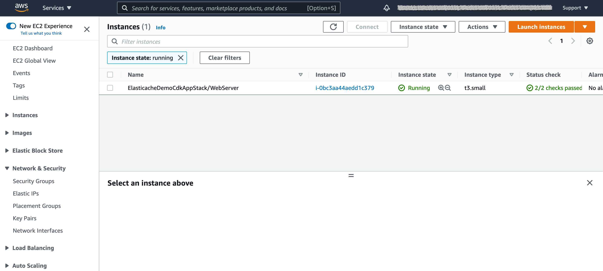


On the Amazon RDS console, verify if the MySQL instance was created and is available.

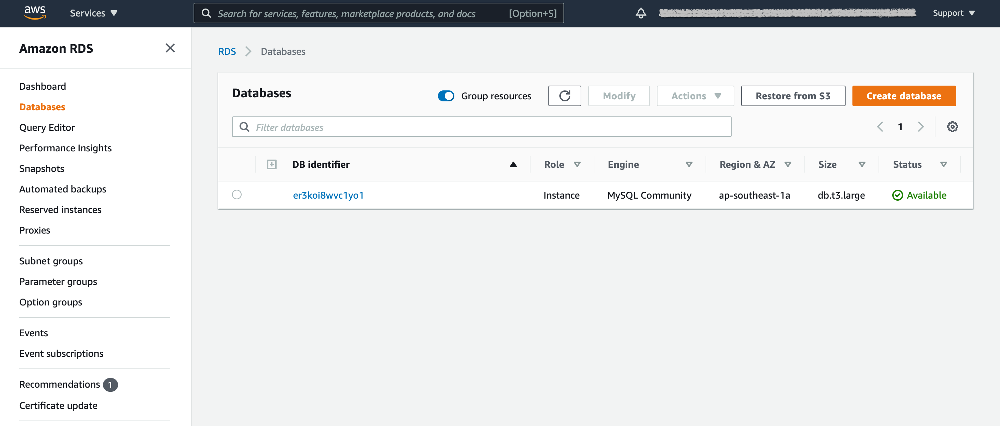


On the ElastiCache console, verify if the Redis cluster is available.

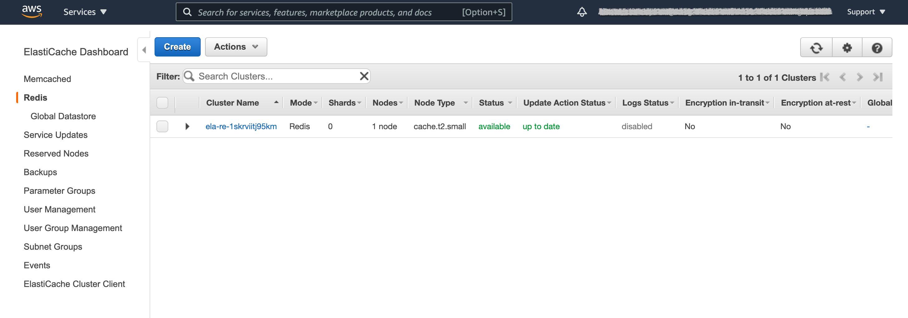


The Amazon RDS CDK construct also automatically creates a secret in Secrets Manager. You can view the secret name in the CloudFormation stack outputs. The secret contains the MySQL user admin, automatically generated password, database host, and database name.

The web application retrieves this information automatically from Secrets Manager, so you don’t need to note down these values.


## Connect to the web server EC2 instance

We connect to the web server instance using [AWS Systems Manager Session Manager](https://docs.aws.amazon.com/systems-manager/latest/userguide/session-manager.html) through the [AWS Management Console](http://aws.amazon.com/console). Leaving inbound SSH ports and remote PowerShell ports open on your managed nodes greatly increases the risk of entities running unauthorized or malicious commands on the managed nodes. Session Manager helps you improve your security posture by letting you close these inbound ports, freeing you from managing SSH keys and certificates, bastion hosts, and jump boxes.

1. On the Amazon EC2 console, choose **Instances** in the navigation pane.

2. Select the web server and choose **Connect**.


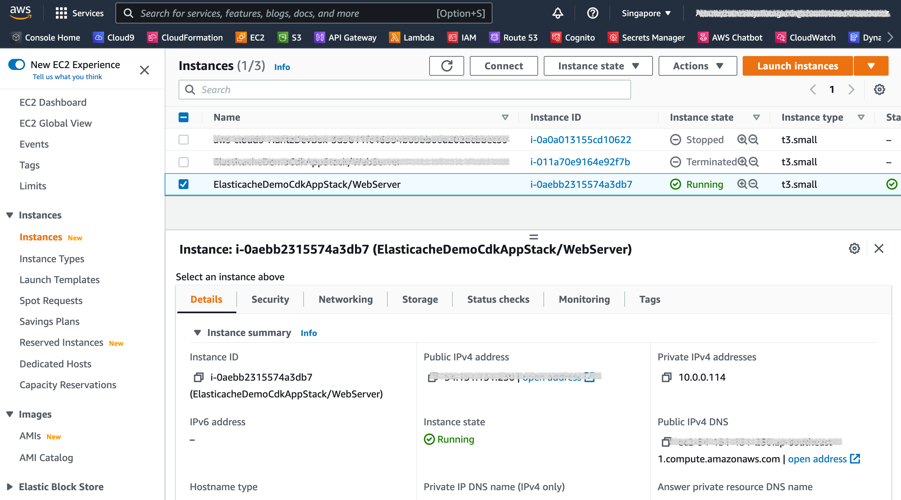


3. On the **Session Manager** tab, choose **Connect**.

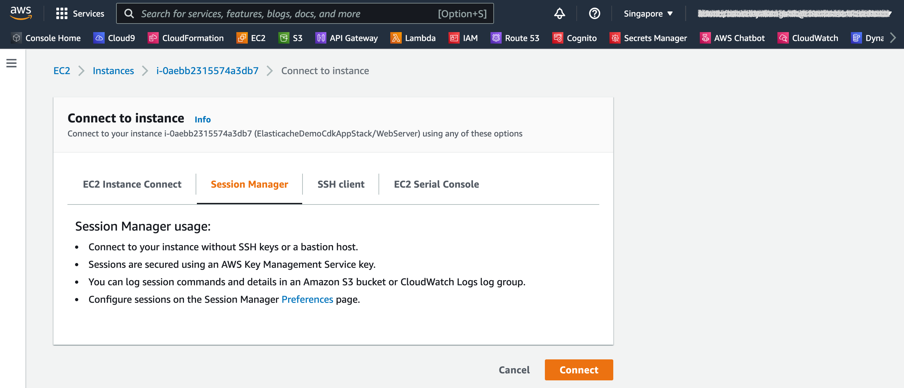

You log in as `ssm-user`. However, the web server's user data script is run for  `ec2-user`. 

4. Switch to `ec2-user` using the following command.

```shell
sudo su - ec2-user
```


You should land in the `ec2-user` home directory `/home/ec2-user`, which should contain the `elasticache-demo-cdk-application` sub-folder. This is the same repository that you cloned on your local machine. It contains the sample data that is inserted into the MySQL database as well as the web application. You can find the sample dataset and the web application in the `sample-dataset` and `web-app` subfolders, respectively. 


Let's navigate to the web application subfolder from the home directory and see the content:

```shell
ls -l 
cd amazon-elasticache-demo-using-aws-cdk
ls -l 
cd web-app 
ls -l 
```


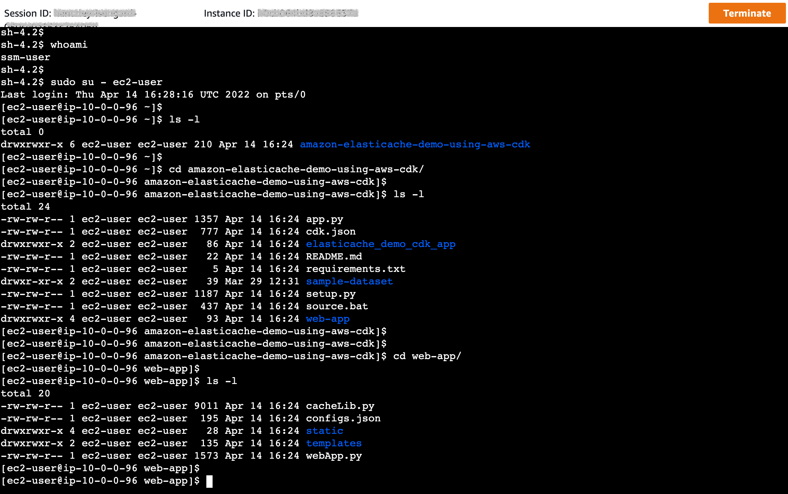


### **Overview of the web application**

The web application is a Python [Flask](https://www.fullstackpython.com/flask.html) application. The file [webApp.py](https://github.com/aws-samples/amazon-elasticache-demo-using-aws-cdk/blob/main/web-app/webApp.py) is the main application, which contains the Flask routes for each operation, for example, query MySQL database and query cache. The following snippet for the query cache function:


```python
@app.route("/query_cache")
def query_cache_endpoint():
    data = None 
    start_time = datetime.now()
    result = query_mysql_and_cache(sql,configs['db_host'], configs['db_username'], configs['db_password'], configs['db_name'])
    delta = (datetime.now() - start_time).total_seconds()    

    if isinstance(result['data'], list):
        data = result['data']
    else:
        data = json.loads(result['data'])

    return render_template('query_cache.html', delta=delta, data=data, records_in_cache=result['records_in_cache'], 
                                TTL=Cache.ttl(sql), sql=sql, fields=db_tbl_fields)

```


The `webApp.py` file imports `cacheLib` . The file `cacheLib.py` contains the key procedures to perform the following actions: 

- Retrieve the MySQL and ElastiCache for Redis endpoints from the CloudFormation stack outputs
- Load the sample data into the MySQL database
- Store all configurations in `config.json` which is automatically created when the application is run for the first time
- Query the MySQL database
- Query Amazon ElastiCache


Refer to the [cacheLib.py](https://github.com/aws-samples/amazon-elasticache-demo-using-aws-cdk/blob/main/web-app/cacheLib.py) file to understand the respective functions. One of these functions is called `query_mysql_and_cache` , which is triggered by the web application under the `@app.route("/query_cache")`. This function checks if the dataset is in the cache first. If there is a cache hit, the dataset is served by ElastiCache at low latency. Otherwise, the dataset is retrieved from MySQL and then cached into ElastiCache for future queries. The following is the `query_mysql_and_cache` code snippet:

```python
def query_mysql_and_cache(sql,db_host, db_username, db_password, db_name):
    '''
    This function retrieves records from the cache if it exists, or else gets it from the MySQL database.
    '''     

    res = Cache.get(sql)

    if res:
        print ('Records in cache...')
        return ({'records_in_cache': True, 'data' : res})
          
    res = mysql_fetch_data(sql, db_host, db_username, db_password, db_name)
    
    if res:
        print ('Cache was empty. Now populating cache...')  
        Cache.setex(sql, ttl, json.dumps(res))
        return ({'records_in_cache': False, 'data' : res})
    else:
        return None
```


## Start the Web Application

The necessary runtimes and modules were already installed at instance creation using the **userdata** contained in the `user_data.sh` file in the AWS CDK application. 


Let's start the web application with the following command:

```shell
sudo python3 webApp.py 
```


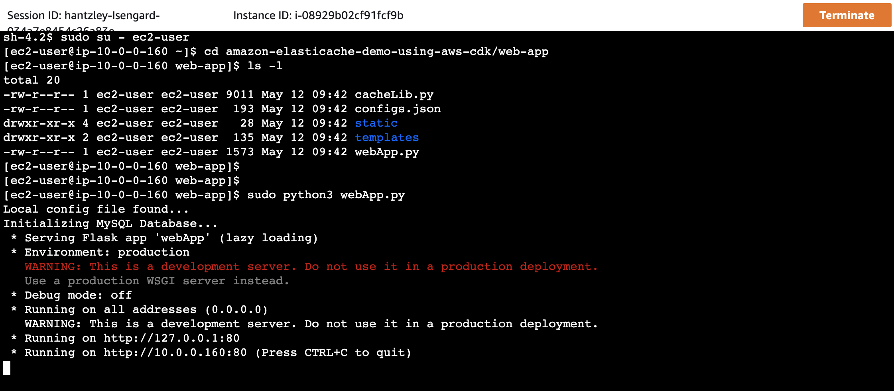


## Use the web application

From a browser, access the web server's public IP address or URL with port 8008 (or any other ports if you changed it), for example, http://WEBSERVER-PUBLIC-IP:8008. This should take you to the landing page of the web application, as shown in the following screenshot:

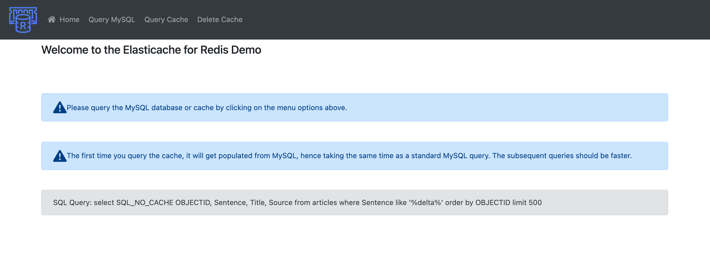

If you cannot access the site using port 8008, you can be behind a VPN or firewall that is blocking that port. Try disconnecting your VPN or switching network.

Now let's query the MySQL database. Choose **Query MySQL** on the navigation bar.

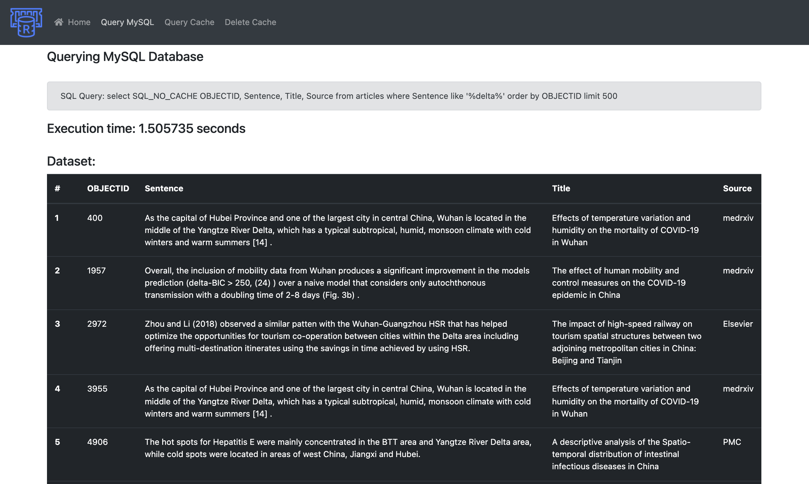


You can review the time it took to run the query. Now let's try to query the cache by choosing **Query Cache**.

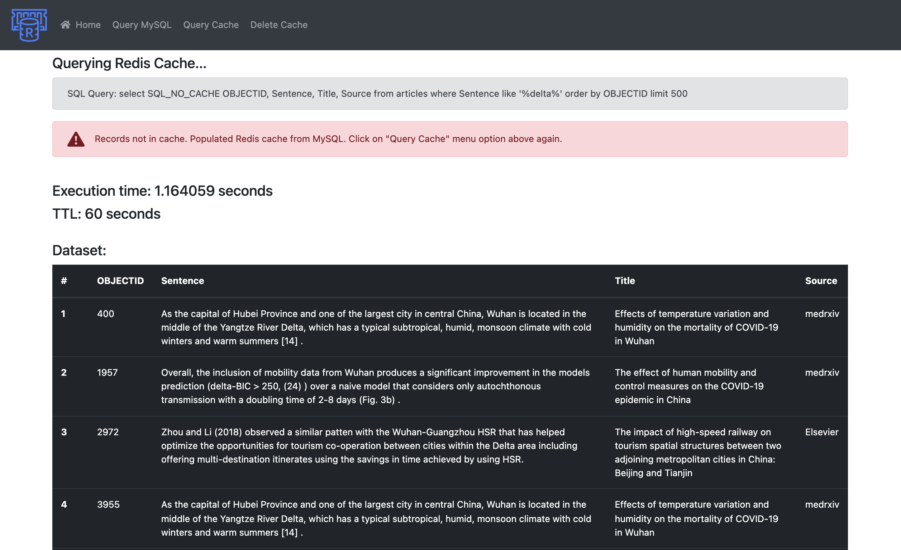


Notice that it took almost the same time to run. This is because the first time you access the Redis cache, it’s empty. So the application gets the data from the MySQL database and then caches it into the Redis cache. 

Now, try querying the cache again and observe the new runtime. You should see a value in the order of milliseconds. This is very fast!

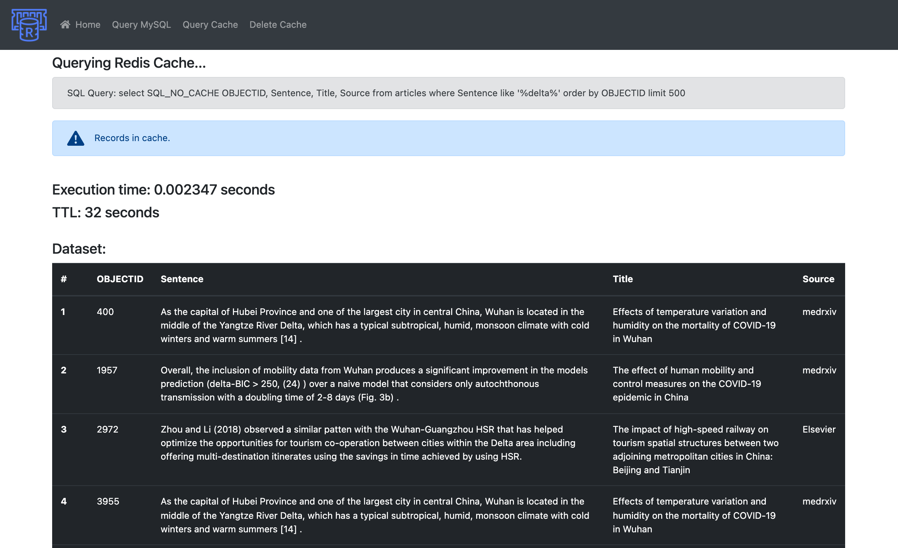


If you look at your terminal, you can see the HTTP requests made from the browser. This can be helpful if you need to troubleshoot.

```shell
[ec2-user@ip-10-0-0-96 web-app]$ python3 webApp.py
Local config file found...Initializing MySQL Database...
 * Serving Flask app 'webApp' (lazy loading)
 * Environment: production
   WARNING: This is a development server. Do not use it in a production deployment.
   Use a production WSGI server instead.
 * Debug mode: off * Running on all addresses (0.0.0.0)
   WARNING: This is a development server. Do not use it in a production deployment. * Running on http://127.0.0.1:8008
 * Running on http://10.0.0.96:8008 (Press CTRL+C to quit)
151.192.221.101 - - [14/Apr/2022 16:36:41] "GET / HTTP/1.1" 200 -
151.192.221.101 - - [14/Apr/2022 16:36:41] "GET /static/css/custom.css HTTP/1.1" 200 -151.192.221.101 - - [14/Apr/2022 16:36:41] "GET /static/img/redis.png HTTP/1.1" 200 -
151.192.221.101 - - [14/Apr/2022 16:36:42] "GET /favicon.ico HTTP/1.1" 404 -
Cache was empty. Now populating cache...151.192.221.101 - - [14/Apr/2022 16:36:46] "GET /query_cache HTTP/1.1" 200 -
151.192.221.101 - - [14/Apr/2022 16:36:46] "GET /static/css/custom.css HTTP/1.1" 304 -151.192.221.101 - - [14/Apr/2022 16:36:46] "GET /static/img/redis.png HTTP/1.1" 304 -
Records in cache...151.192.221.101 - - [14/Apr/2022 16:36:47] "GET /query_cache HTTP/1.1" 200 -
151.192.221.101 - - [14/Apr/2022 16:36:47] "GET /static/css/custom.css HTTP/1.1" 304 -151.192.221.101 - - [14/Apr/2022 16:36:47] "GET /static/img/redis.png HTTP/1.1" 304 -
Records in cache...
151.192.221.101 - - [14/Apr/2022 16:36:49] "GET /query_cache HTTP/1.1" 200 -
151.192.221.101 - - [14/Apr/2022 16:36:49] "GET /static/css/custom.css HTTP/1.1" 304 -
151.192.221.101 - - [14/Apr/2022 16:36:49] "GET /static/img/redis.png HTTP/1.1" 304 -
Records in database...
```


## Clean up

To avoid unnecessary cost, clean up all the infrastructure created with the following command on your workstation:

```shell
(.venv) [~/amazon-elasticache-demo-using-aws-cdk] $ cdk destroy
Are you sure you want to delete: ElasticacheDemoCdkAppStack (y/n)? y
ElasticacheDemoCdkAppStack: destroying...


 ✅  ElasticacheDemoCdkAppStack: destroyed                                     
```


## Conclusion

As demonstrated in this post, you can use AWS CDK to create the infrastructure for an Amazon ElastiCache application. We showed the difference in runtime between ElastiCache and an Amazon RDS with MySQL engine.

You can now build your own infrastructure and application using the caching capability of Amazon ElastiCache to accelerate performance for a better user experience.


## License summary

This sample code is made available under a modified MIT license. See the LICENSE file for more information.

